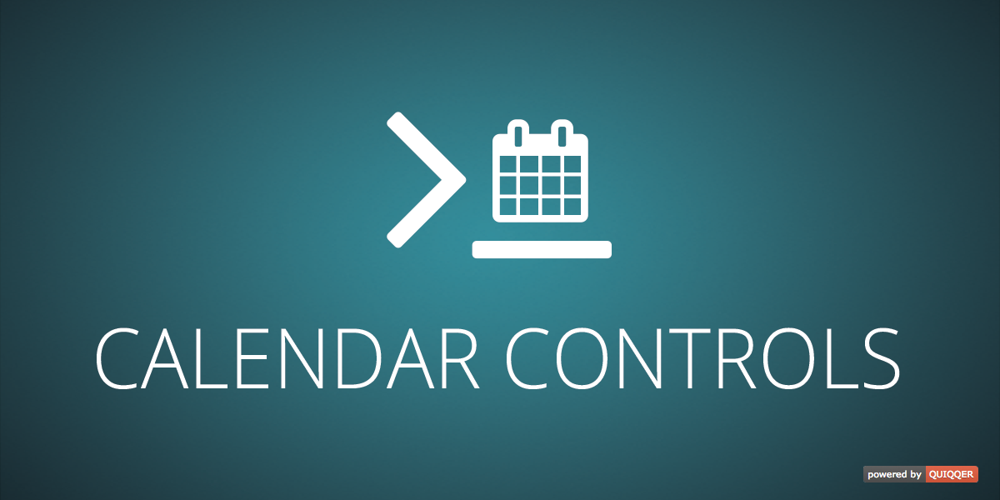

QUIQQER Calender Controls
========

GUI Element to display a calendar.

Package name:

    quiqqer/calendar-controls


Features
--------

- JavaScript Calendar Control
- JavaScript Calendar Scheduler


Installation
------------

The package name is: quiqqer/calendar-controls


Contribution
----------

- Issue Tracker: https://dev.quiqqer.com/quiqqer/calendar-controls/issues
- Source Code: https://dev.quiqqer.com/quiqqer/calendar-controls/tree/master


Support
-------

If you found any flaws, have any wishes or suggestions you can send an email
to [support@pcsg.de](mailto:support@pcsg.de) to inform us about your concerns. 
We will try to respond to your request and forward it to the responsible developer.


License
-------

GNU GPL v2


Usage
-----

### Javascript: Get Scheduler:

A scheduler is a calendar object which manages a calendar.  
Scheduler: https://dhtmlx.com/docs/products/dhtmlxScheduler/  

```javascript

require(['package/quiqqer/calendar-controls/bin/Scheduler'], function(Scheduler) {
    console.log(Scheduler.getScheduler());
});

```

### JavaScript: Load Scheduler Extensions:

```javascript

require([
    'package/quiqqer/calendar-controls/bin/Scheduler'
], function(Scheduler) {
    Scheduler.loadExtension('agenda_view').then(function(Scheduler) {
        console.log(Scheduler.getScheduler());
    });
});

```

```javascript

// Load multiple extensions

require([
    'package/quiqqer/calendar-controls/bin/Scheduler'
], function(Scheduler) {
    Promise.all([
        Scheduler.loadExtension('agenda_view'),
        Scheduler.loadExtension('collision'),
        Scheduler.loadExtension('cookie')
    ]).then(function(Scheduler) {
        console.log(Scheduler.getScheduler());
    });
});

```

### JavaScript: TimeFilter / Time Select

```javascript

require(['package/quiqqer/calendar-controls/bin/controls/TimeFilter', function(TimeFilter) {

    // buttons
    var Filter = new TimeFilter({
        name  : 'timeFilter',
        events: {
            onChange: function() {

            }
        }
    });

});


```
